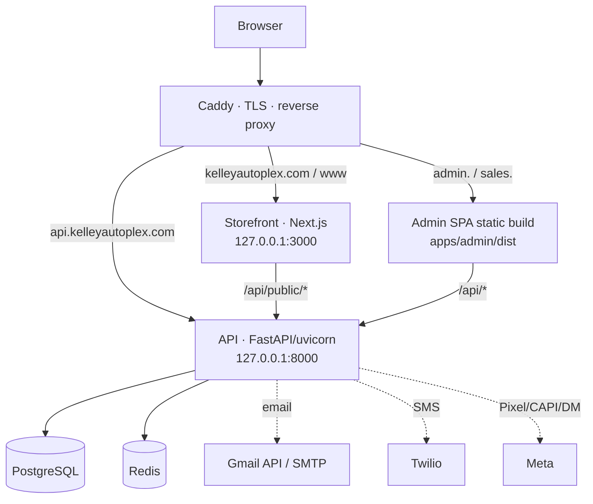

# Architecture

System design and boundaries for the Kelley Autoplex platform. This is the
authoritative architecture reference; for production procedures see
[OPERATIONS.md](OPERATIONS.md), and for contributor rules see
[../CLAUDE.md](../CLAUDE.md).

## 1. System overview

Kelley Autoplex is a used-car dealership platform with three applications behind
one reverse proxy. The **FastAPI backend is the single system of record** —
inventory, CRM/deals, quotes, invoices, payments, staff, scheduling, messaging,
and notifications all live there. The admin/sales SPA and the public storefront
are presentation layers that read and write through the API over HTTP.

Everything runs on a single VPS: systemd supervises the API and storefront
processes; Caddy terminates TLS and routes by hostname; PostgreSQL and Redis run
locally.

## 2. Deployment / data flow

The admin and sales surfaces are the **same static build** served from
`apps/admin/dist`; the app chooses which surface to render at runtime from the
hostname (`sales.*` → sales).

## 3. Applications and packages

| Component | Path | Stack | Serving |
|---|---|---|---|
| API | `apps/api` | FastAPI + SQLAlchemy 2.0, uvicorn (2 workers) | `127.0.0.1:8000` |
| Admin + Sales SPA | `apps/admin` | Vite 6, React 19, MUI 6, TanStack Query 5, React Router 6, axios | static `apps/admin/dist` via Caddy |
| Storefront | `apps/storefront` | Next.js 15, React 19, Tailwind 4 | `127.0.0.1:3000` |
| `packages/shared-types` | `packages/shared-types` | `@kelley/shared-types` — shared enums (`EVENT_TYPES`, `INBOX_CHANNELS`) | **scaffolded; no app imports it yet** |
| `packages/brand-assets` | `packages/brand-assets` | `@kelley/brand-assets` — ownership placeholder | **placeholder; holds no assets** |

The pnpm workspace covers `apps/admin`, `apps/storefront`, and `packages/*`.
`apps/api` is a standalone Python app (its own `.venv`), not a workspace member.

## 4. Backend modules

The backend is organized into **eight domain modules** under `apps/api/modules/`.
Each module owns its routers, services, and (where applicable) background
workers. `core` and `contacts` are **kernel** modules — always enabled. The other
six are gated by a `MODULE_<NAME>_ENABLED` setting, all defaulting to **true**.

| Module | Responsibility | Enable flag (default) | Router mounts | Workers | Can disable? |
|---|---|---|---|---|---|
| `core` | auth, staff, business profile, notifications infra, global search, cron state | — (kernel) | 13 | `notifications`, `daily` | No |
| `contacts` | contact/customer records, lead PII, buyer journey | — (kernel) | 1 | — | No |
| `messaging` | inbox, web chat, Twilio + Meta webhooks | `MODULE_MESSAGING_ENABLED` (true) | 4 | — | Yes |
| `deals` | events, invoices, quotes, payments, customer portal, special orders | `MODULE_DEALS_ENABLED` (true) | 19 | — | Yes |
| `inventory` | vehicle catalog, VIN decode, pricing | `MODULE_INVENTORY_ENABLED` (true) | 2 | — | Yes |
| `scheduling` | shifts, schedules, time-off, clock/attendance | `MODULE_SCHEDULING_ENABLED` (true) | 16 | `schedule_monitor` | Yes |
| `booking` | public booking, walk-ins, sales appointments | `MODULE_BOOKING_ENABLED` (true) | 6 | — | Yes |
| `analytics` | storefront analytics, attribution, Meta CAPI, dashboards | `MODULE_ANALYTICS_ENABLED` (true) | 3 | — | Yes |

There are 64 router mounts in total, contributing **294 total app routes (289
HTTP API endpoints across 240 OpenAPI paths)**.

**What "disabled" means:** a disabled module does not mount its routers and does
not start its workers. Its Python package and its models **still import** — every
table always registers (see §7). Disabling changes the served surface, not the
schema.

## 5. Router registry

Router registration and worker startup are data-driven from
`apps/api/modules/registry.py`:

- **`MOUNTS`** is an explicit, hand-maintained list of `RouterMount` entries
  (router + prefix/tags + owning module). `server.py` iterates it and calls
  `app.include_router(...)` **synchronously at app construction**. The order
  reproduces the historical registration order, preserving the OpenAPI contract.
  There is no filesystem scanning.
- A mount is skipped when its owning module is disabled.
- **Routers are never mounted inside the lifespan.**

## 6. Worker lifecycle

Background workers are `WorkerDef` entries attached to their owning module in
`registry.py`, started in the FastAPI **lifespan** (`server.py`) as
`asyncio.create_task(runner(stop_event))`. On shutdown the app signals the stop
event, waits ~5s for graceful exit, then cancels.

| Worker | Owning module | Notes |
|---|---|---|
| `notifications` | `core` | notification delivery loop |
| `daily` | `core` | cross-domain daily aggregator (also drives deals reminders, webhook retention) |
| `schedule_monitor` | `scheduling` | schedule monitoring (and the analytics CAPI tick) |

Worker code lives in `apps/api/workers/`. A disabled module's workers do not
start.

## 7. Model facade and database ownership

Models are split into per-domain files under `apps/api/database/models/`
(`core`, `contacts`, `messaging`, `deals`, `inventory`, `scheduling`, `booking`,
`analytics`). A **permanent facade** in `database/models/__init__.py` re-exports
every class, so `from database.models import <Name>` keeps working for all
callers.

- **All models import unconditionally**, regardless of module enable flags, so
  every table registers on the shared `Base.metadata`.
- The facade exposes **88 public exports** — 69 model classes (one per table),
  plus `Base` and the SQLAlchemy column/type helpers re-exported for convenience.
- There are **69 tables**.

## 8. Immutable migrations

Migrations live in `apps/api/database/migrations/` as flat, sequentially
numbered files (`001_*.py` … `097_*.py`, **97 total**). They are **append-only
and immutable** — historical artifacts that must stay byte-for-byte identical so
a fresh replay reproduces production exactly. New schema work is always a **new**
numbered file; existing migrations are never edited, renumbered, or squashed. The
runner (`python -m database.migrations.runner`) applies forward-only and tracks
applied files in a `schema_migrations` table. There is no downgrade path.

## 9. Historical migration compatibility package

`apps/api/services/` is **not** an application service directory — application
services live in `modules/<domain>/services/`. It is a **narrow, permanent
compatibility surface**: migrations `061` and `062` import a service function at
`upgrade()` time using the pre-restructure flat `services.*` path, and those
migrations are immutable. This package re-exports **only** those specific symbols
(`integration_tokens`, `quote_signature_hmac`) so a fresh migration replay
resolves. It is not a general shim; a guard smoke
(`tests/test_services_compat_guard_smoke.py`) fails if active application source
imports from `services.*`.

## 10. Lead → payment flow

The core CRM flow spans several modules:

1. A lead arrives — via the storefront (`POST /api/public/leads`), the booking
   widget, or a staff walk-in — and creates a `vehicle_sale` **deal** (event)
   with an associated **contact** (identified by phone / E.164).
2. Staff work the deal through its status workflow.
3. **Quotes** are built from the vehicle/catalog; an approved quote can convert
   to an **invoice**.
4. **Payments** (and refunds) are recorded against invoices and applied.

`deals` owns events/quotes/invoices/payments; `contacts` owns the customer
identity; `inventory` supplies the vehicle; `booking` supplies appointments and
walk-ins; `analytics` records attribution and milestones.

## 11. Admin and sales SPA

`apps/admin` is one Vite/React build that serves two surfaces from the **same
bundle**, chosen at runtime by hostname. `isSalesSubdomain()` (in
`src/services/api/client.js`) returns true for `sales.*` hosts (the trailing dot
in `startsWith('sales.')` is deliberate, so a future `salesreports.*` host would
not match). `App.jsx` mounts the sales app for sales hosts and the admin app
otherwise. The two apps have separate auth contexts, routers, and session
cookies.

## 12. API client split

All admin/sales API calls go through `src/services/api/`:

- **`client.js`** owns the single `axios.create` instance
  (`withCredentials: true`), the CSRF request interceptor (adds `X-CSRF-Token`
  from the admin or sales CSRF cookie on unsafe methods), and the `401` →
  `/login` response interceptor. It also exports `isSalesSubdomain`.
- **16 domain modules** hold the endpoint functions and import `api` from
  `./client`.
- **`index.js`** is a barrel re-exporting every module plus the default Axios
  instance; existing code imports from `services/api`. No module inside
  `services/api/` imports the barrel (cycle safety). The surface is frozen at
  **227 named exports + 1 default** and guarded by `check:api-exports`.

## 13. Lazy loading and bundle structure

Every page-level route in both `App.jsx` and `sales/SalesApp.jsx` is
`React.lazy` + `Suspense`, and `SalesApp` itself is lazy from `App.jsx`, so the
admin surface never downloads sales page chunks and vice versa. `vite.config.js`
`manualChunks` groups vendor code into `react-vendor`, `mui`, `query`, `dnd`, and
`vendor` chunks. When built from current source, the initial JavaScript graph is
**801,571 raw / 248,474 gzip bytes** across five shared chunks (down from a
single ~1,386,895 raw / ~401,845 gzip bundle — a ~42% reduction), with ~47
lazily-loaded route chunks.

> **Not yet deployed.** The live `apps/admin/dist` still serves the pre-split
> single-bundle build (the ~1.39 MB monolith). The split/chunked build above is
> what current source produces; it deploys in Phase 6 (Window B). This is the
> admin-SPA analogue of the pre-Phase-3 backend still running in production
> (see [OPERATIONS.md §20](OPERATIONS.md#20-window-b-phase-6-preflight-risks)).

## 14. Shared packages

- **`@kelley/shared-types`** — a small ESM package exporting `EVENT_TYPES` and
  `INBOX_CHANNELS`. It is **scaffolded and not yet consumed by any app**; the
  Python API remains the runtime authority for these enums. Treat it as intended
  future consolidation, not completed adoption.
- **`@kelley/brand-assets`** — an ownership **placeholder** with no assets. The
  email wordmark deliberately stays checked in at
  `apps/api/assets/email/`; email rendering must not depend on resolving this
  package.

## 15. Known cross-domain coupling

The backend modules are cleanly separated at the router/worker level but retain
**pre-existing cross-domain imports** (made visible, not removed, by the Phase 3
modularization — untangling them was out of scope). The dependency graph is **not
acyclic**:

| Module | Imports from |
|---|---|
| `core` | analytics, booking, contacts, inventory |
| `contacts` | analytics, booking, core, inventory |
| `messaging` | analytics, booking, contacts, core |
| `deals` | analytics, booking, contacts, core, inventory, scheduling |
| `inventory` | core |
| `scheduling` | analytics, booking, contacts, core |
| `booking` | analytics, contacts, core, inventory, scheduling |
| `analytics` | booking, core |

Because of this coupling, disabling an optional module removes its routes and
owned workers but does not make the codebase importable without the modules it
depends on — every package still imports.

## 16. Security / session overview

- **Auth** is cookie-based: the session lives in an HttpOnly cookie the browser
  attaches automatically; JavaScript cannot read it. A separate readable CSRF
  cookie is mirrored into an `X-CSRF-Token` header on unsafe methods, verified
  server-side. Admin and sales surfaces use distinct CSRF cookies.
- **Middleware** order (outermost first): CORS, CSRF, security headers. Allowed
  CORS origins are the union of `CORS_ORIGINS` and
  `BOOKING_WIDGET_ALLOWED_ORIGINS`.
- **Sensitive data**: lead PII (DOB/DL/address) is stored encrypted and
  permissioned in the contacts domain, not in plaintext notes. Analytics/CAPI
  must never forward BHPH PII (DOB/SSN) to Meta; CAPI identifiers are hashed
  server-side.

Exact secret handling and environment variables are covered in
[OPERATIONS.md](OPERATIONS.md); no secret values appear in this repository.

## 17. Boundaries and deferred improvements

- **Cross-domain coupling** (§15) is intentionally deferred — the modules are
  registry-separated but not import-independent.
- **`@kelley/shared-types` / `@kelley/brand-assets`** consolidation is scaffolded
  but not wired up; the API and the checked-in email asset remain authoritative.
- **Staged/recoverable deploy artifacts** do not exist yet — production builds
  currently write in place (see [OPERATIONS.md](OPERATIONS.md)); this is a Phase
  6 (Window B) preflight item.
- **Browser end-to-end verification** for the admin/sales SPA is outstanding
  (Chromium system libraries unavailable on the VPS) and is a release gate.
